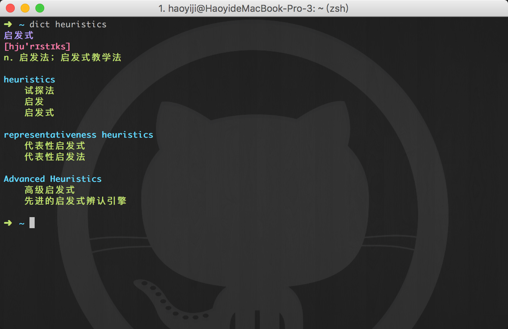

### Dicterm

Dicterm is a dictionary application in terminal.

First, you'll need to open an developer account on [Netease api](http://fanyi.youdao.com/openapi?path=data-mode). Then put your app name and app key in the code below:

And you are all set!
